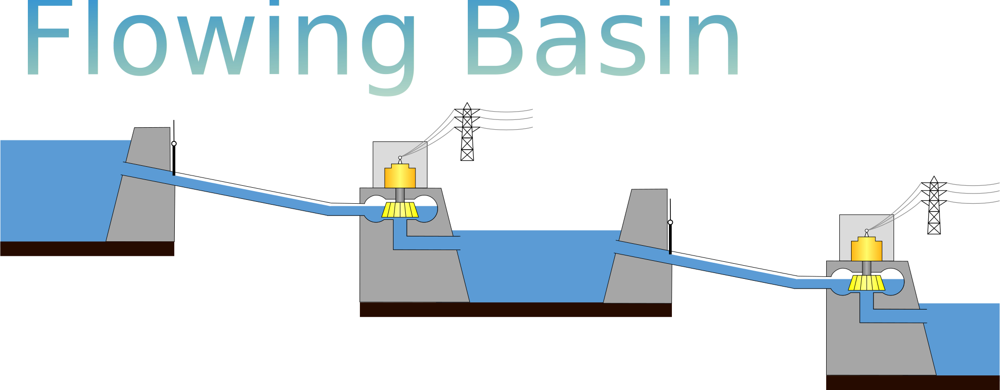

# Flowing Basin

<p align="center">
  
</p>

🔗 [[Paper - MILP & PSO](https://doi.org/10.1007/s10100-024-00934-z)] [Paper - RL] [[Thesis](https://oa.upm.es/82355/)] [[Dataset](https://1drv.ms/f/s!AigX06Gtq-2Ai7YGDn7UljVy-f0ozg?e=c7ZHQJ)] [[MILP & PSO solution files](https://1drv.ms/f/s!AigX06Gtq-2Ai6kOGRz0W8jCf7f41w?e=USr7V8)] [[RL model weights](https://1drv.ms/f/s!AigX06Gtq-2Ai7Ycn7bbyeHp-cj0fQ?e=5dKfcd)]

**Flowing Basin** is a research project focused on the
optimization of hydropower stations having multiple reservoirs.
Unlike previous studies, we address a short-term intraday
optimization problem with the objective of maximizing revenue.
This variant of the problem is called the
Hydropower Reservoirs Intraday Economic Optimization (HRIEO) problem.

We used a variety of methods to tackle the HRIEO problem:
- **Mixed-Integer Linear Programming (MILP)**: an exact linearized optimization
model for the HRIEO problem implemented in [PuLP](https://github.com/coin-or/pulp).
- **Particle Swarm Optimization (PSO)**: a metaheuristic algorithm
adapted to the HRIEO problem and based on [PySwarms](https://github.com/ljvmiranda921/pyswarms).
- **Reinforcement Learning (RL)**: a machine learning approach
involving an agent that learns by interacting with an environment.
In this repository, the environment for the HRIEO problem is based on [Gymnasium](https://github.com/Farama-Foundation/Gymnasium)
and the agent is trained in this environment using [Stable Baselines3](https://github.com/DLR-RM/stable-baselines3).

The HRIEO problem, the MILP model and the PSO algorithm
are explained in [this paper](https://doi.org/10.1007/s10100-024-00934-z).
The RL approach is explained in another paper that has not been published yet.
In addition, both the PSO algorithm and the RL approach are detailed in
[this Bachelor's Final Project](https://oa.upm.es/82355/).

This document explains how to install the dependencies
of this repository, where to find the data and input instances,
how to run the MILP and PSO methods for a specific problem instance,
and how to train and run a RL agent.

## Installation

The project is written in Python 3.12.
You can install all the dependencies of the project using the following command:
```python
pip install -r requirements.txt
```

## Experiments

We have tested our methods in:
- The **six configurations** contained in `flowing_basin/rl_data/configs/general`.
These are named `G0`, ..., `G2`, each having a different
number of dams and operational constraints.
- The **eleven problem instances** contained in `flowing_basin/instances/instances_base`. 
These are named `Percentile00`, `Percentile10`, ..., `Percentile100`,
ranging from the driest to the rainiest day of the dataset.

The solutions obtained with the MILP and PSO
methods for these instances are available at [this URL](https://1drv.ms/f/s!AigX06Gtq-2Ai6kOGRz0W8jCf7f41w?e=USr7V8).

## Run the solvers

### Solve an existing instance

The easiest way to run any of the solvers is to use the `Baseline`
wrapper class. The following code snippet solves the instance `Percentile50`
under configuration `G3` using all available solvers and stores each solution
in the folder `flowing_basin/rl_data/baselines/G3`:

```python
from flowing_basin.solvers import Baseline

config = 'G3'  # Consider 6 dams and no flow smoothing, startup or limit zone penalty
instance = 'Percentile50'  # Solve the instance with intermediate inflow level

# Use the MILP solver
Baseline(general_config=config, solver='MILP').solve(instance_names=[instance])

# Use the PSO solver (default parameters; random and RBO initialization)
Baseline(general_config=config, solver='PSO').solve(instance_names=[instance])
Baseline(general_config=config, solver='PSO-RBO').solve(instance_names=[instance])

# Use a trained RL agent
Baseline(general_config=config, solver='rl-A21G3O3R1T74').solve(instance_names=[instance])
```

> ⚠️ In order to run a trained RL agent, you must
put the folder with its weights in `flowing_basin/rl_data/models`.
The weights of all agents trained for this project can be
found at [this URL](https://1drv.ms/f/s!AigX06Gtq-2Ai7Ycn7bbyeHp-cj0fQ?e=5dKfcd).

### Create and solve a new instance

The **instance** is a file indicating both the constants characterizing the hydropower station
(e.g., maximum volume) and the variables of the day (e.g., water inflows and energy prices).

We have tested our methods in the eleven problem instances detailed above.
If you want to **create a new instance**, you can follow these steps:
1. Create a JSON file following the schema in `flowing_basin/schemas/instance.json`.
2. Move the file to the folder `flowing_basin/instances/instances_big`.
3. Name the file like `instance{instance_name}_{num_dams}dams_1days.json`, where:
   - `{instance_name}` should be replaced the name of the instance (e.g., `Example1`).
   - `{num_dams}` should be replaced with the number of dams (e.g., 6).

After following these steps, you will be able to solve the instance
(using, for example, the MILP model) by running:

```python
from flowing_basin.solvers import Baseline

config = 'G3'  # Consider 6 dams and no flow smoothing, startup or limit zone penalty
instance = 'Example1'  # Instance you just created

Baseline(general_config=config, solver='MILP').solve(instance_names=[instance])
```

### Tune the PSO algorithm

The `Baseline` class can also be used to tune the parameters of the PSO algorithm.
The following code snippet will tune the PSO for the `G3` configuration,
running 100 trials with alternative parameters and storing the best values found
in :

```python
from flowing_basin.solvers import Baseline

config = 'G3'  # Consider 6 dams and no flow smoothing, startup or limit zone penalty
Baseline(general_config=config, solver='PSO').tune(num_trials=100)
```

Internally, this function uses [Optuna](https://github.com/optuna/optuna) for parameter tuning.
By default, the instances used for tuning are `Percentile25` and `Percentile75`,
not included among the eleven instances used in our experiments
(to avoid overfitting).

### Train a RL agent

Any RL agent can be trained using the `ReinforcementLearning` class.
This class only needs one argument: the agent name.
This name encodes the configuration used for training the agent.

For example, the agent name `rl-A1G0O1R1T1` implies the use of the `A1` action configuration,
the `G0` general configuration, the `O1` observation configuration,
the `R1` reward configuration, and the `T1` training configuration.
The available configurations are in the folder `flowing_basin/rl_data/configs`.

The following code snippet will train the agent `rl-A1G0O1R1T1`
for 1,000 timesteps and store the resulting weights
as a folder inside `flowing_basin/rl_data/models`:

```python
from flowing_basin.solvers.rl import ReinforcementLearning

rl = ReinforcementLearning("rl-A1G0O1R1T1", verbose=3)
rl.train(num_timesteps=1000)
```

> ⚠️ In order to train a RL agent, you must
put the training and testing datasets
inside the folder `flowing_basin/data/history`.
The datasets can be found at [this URL](https://1drv.ms/f/s!AigX06Gtq-2Ai7YGDn7UljVy-f0ozg?e=c7ZHQJ).

## 📚 Citation
If you find our work useful, please consider citing our papers:
- Paper detailing the HRIEO problem, the MILP model and the PSO algorithm (found [here](https://doi.org/10.1007/s10100-024-00934-z)):
    ```
    @article{Castro-Freibott2024,
      author = {Rodrigo Castro-Freibott and Carlos Garc{\'i}a-Castellano Gerbol{\'e}s and Alvaro Garc{\'i}a-S{\'a}nchez and Miguel Ortega-Mier},
      title = {MILP and PSO approaches for solving a hydropower reservoirs intraday economic optimization problem},
      journal = {Central European Journal of Operations Research},
      year = {2024},
      month = {sep},
      volume = {},
      number = {},
      pages = {},
      doi = {10.1007/s10100-024-00934-z},
      url = {https://doi.org/10.1007/s10100-024-00934-z},
      issn = {1613-9178}
    }
    ```
- Paper detailing the RL approach (found here):
    ...